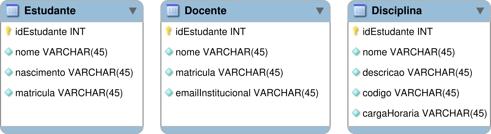
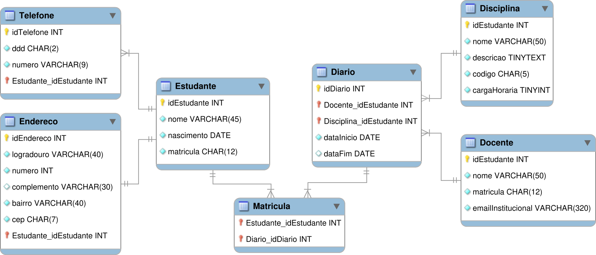

# ♻ Conversão do modelo ER para o modelo relacional

## Step 1. Traduzir as entidades e seus respectivos atributos

No diagrama ER que representa as entidades no banco de dados aqui abordado, temos as entidades: `Estudante`, `Disciplina` e `Docente`. No processo de tradução do MER para o MR, as entidades são traduzidas para tabelas do banco de dados.&#x20;

<figure><figcaption>
Representação das tabelas <code>Estudante</code>, <code>Docente</code> e <code>Disciplina</code>, correspondentes à entidades representados no diagrama entidade-relacionamento.
</figcaption></figure>

Os atributos das entidades, respectivamente, são convertidos em colunas das tabelas. Note que, nas representações das tabelas, as figuras têm uma espécie de losango pintado em <mark style="background-color:blue;">azul claro</mark>. Isso quer dizer que essas colunas **não podem receber valores nulos** — isto é, tem a propriedade **NN** (<mark style="color:blue;">`NOT NULL`</mark>). Quando as colunas podem receber valores nulos (<mark style="color:blue;">`NULL`</mark>), essa figura fica em branco.

Inicialmente, mantivemos os tipos padrões definidos no Workbench. Entretanto, precisaremos aplicar os tipos de dados adequados para cada atributo/coluna mapeado, conforme vimos anteriormente. Sabemos que existe um tipo mais adequado que o <mark style="color:blue;">`VARCHAR`</mark> para representar uma data armazenada no banco, certo?

<figure><figcaption>
Tabelas <code>Estudante</code>, <code>Docente</code> e <code>Disciplina</code> mapeadas a partir das entidades representadas no diagrama ER, agora com seus respectivos atributos.
</figcaption></figure>

### Representando as chaves primárias (PK)

Na representação ilustrada acima, também podemos perceber as chaves primárias (<mark style="color:blue;">`PRIMARY KEY`</mark>) das nossas tabelas referentes às entidades. Forçamos uma coluna cujo padrão de nomenclatura é `id` + `<nome da tabela>`. Por exemplo:&#x20;

* a tabela `Estudante` tem como 🔑 <mark style="color:yellow;">**chave primária (PK)**</mark> o `idEstudante`;&#x20;
* a tabela Docente tem como 🔑 <mark style="color:yellow;">**PK**</mark> a coluna `idDocente`;&#x20;
* e a tabela `Disciplina` tem como 🔑 <mark style="color:yellow;">**PK**</mark> a coluna `idDisciplina`.

### Representando os atributos compostos e multivalorados

Pelas regras de conversão do MER para o modelo relacional, atributos compostos e atributos multivalorados são convertidos em tabelas do banco de dados. Logo, a representação da figura 2, acima, não é capaz de representar, de fato, os requisitos de tal mini-mundo. Neste caso, precisaremos:

* Converter o atributo [`telefones`](#user-content-fn-1)[^1] em uma tabela do banco de dados, cujas colunas podem ser representadas pelo `ddd` e o `numero` do telefone.
* Converter o atributo [`endereco`](#user-content-fn-2)[^2] em uma tabela contendo as colunas: `logradouro`, `numero`, `complemento`, `bairro` e `cep`.

## Step 2. Mapear os relacionamentos

Ao modelar o banco de dados, definimos que o relacionamento entre um docente e uma disciplina é uma associação representada pelo diário de classe — uma turma virtual, com data de início e conclusão da disciplina.&#x20;

Sabe-se também que os estudantes cursam várias disciplinas e estas, por sua vez, são lecionadas pelos docentes. É daí que vem a associação entre docente e disciplina — formando uma **entidade associativa**.&#x20;

<figure><figcaption></figcaption></figure>

[^1]: Um estudante (1) deve ter, no mínimo um (1) e pode ter, no máximo, vários (N) telefones.

[^2]: No ato de matrícula, o estudante obrigatoriamente deve informar um endereço.
