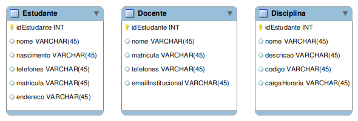
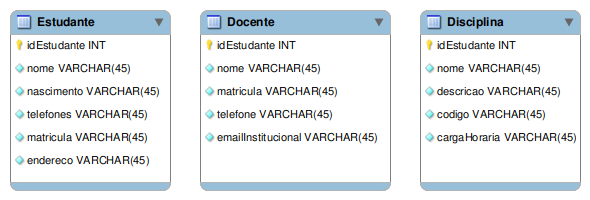

# ♻ Conversão do MER para MR

##

## Step 1. Traduzir as entidades e seus respectivos atributos

No diagrama ER que representa as entidades no banco de dados aqui abordado, temos as entidades: `Estudante`, `Disciplina` e `Docente`.

Estudante(idEstudante, nome, nascimento, matricula, telefones, endereço)

<figure><figcaption></figcaption></figure>

### Definindo os atributos como nulos/opcionais ou não nulos/obrigatórios

<figure><figcaption></figcaption></figure>

### Representando os atributos compostos e multivalorados

Pelas regras de conversão do MER para o modelo relacional, atributos compostos e atributos multivalorados são convertidos em tabelas do banco de dados. Logo, a representação da figura 2, acima, não é capaz de representar, de fato, os requisitos de tal mini-mundo. Neste caso, precisaremos:

* Converter o atributo [`telefones`](#user-content-fn-1)[^1] em uma tabela do banco de dados, cujas colunas podem ser representadas pelo `ddd` e o `numero` do telefone.
* Converter o atributo [`endereco`](#user-content-fn-2)[^2] em uma tabela contendo as colunas: `logradouro`, `numero`, `complemento`, `bairro` e `cep`.

[^1]: Um estudante (1) deve ter, no mínimo um (1) e pode ter, no máximo, vários (N) telefones.

[^2]: No ato de matrícula, o estudante obrigatoriamente deve informar um endereço.
