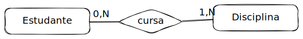

# 🏨 Hotel


**Descrição do mini-mundo**

O BrumaPallace Hotel, o mais badalado da cidade de Brumado - BA, visando dinamizar as reservas de quartos e os serviços ofertados pelo hotel, deseja elaborar um sistema digital de gestão de reservas de quartos.

No BrumaPallace, os clientes podem cadastrar-se ainda que não façam nenhuma reserva. Os clientes podem reservar vários quartos do hotel e um quarto pode ser reservado várias vezes. No ato da reserva, o cliente deve definir uma data prevista para entrada e saída. Quando o cliente ocupa o quarto, registra-se data e hora de entrada e data e hora de saída do quarto.

Para realizar um cadastro, os clientes devem preencher um formulário com o nome, sobrenome, pronomes de tratamento (ele/dele, ela/dela, etc.), idade (clientes menores de idade não são permitidos!), e-mail e telefones para contato. Obrigatoriamente, o cliente deve informar o e-mail, mas os telefones são opcionais. Já os quartos são cadastrados pelo andar, número, capacidade (quantas pessoas comporta um quarto: individual, duplo, triplo, etc.) e preço da diária.&#x20;

Os frigobares dos quartos são abastecidos com diversos produtos, que os clientes optam por consumir ou não. Quando um cliente consome um produto de um quarto, registra-se o produto consumido e a quantidade. Todo produto possui um nome, uma marca, uma descrição, unidade de medida base (exemplo: litro, mililitro, pacote, grama), preço unitário, que é usado como base para o cálculo dos produtos consumidos numa reserva. Exemplo: Refrigerante Brumaraná custa cinco reais (R$ 5) a garrafa de 500 ml. Registra-se, em relação ao quarto reservado pelo cliente, quantas garrafas foram consumidas.


### Step 1. Identificar as entidades

## Step 2

