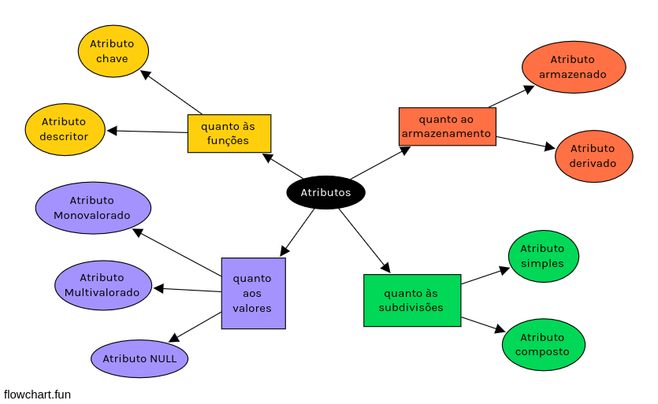

# 🧠 Copy of Tipos de atributos

##

* <mark style="color:purple;background-color:purple;">**Atributo único/monovalorado/univalorado**</mark>**:** apresentam “um valor único para uma entidade em particular” (ELMASRI; NAVATHE, 2011, p. 135);
* <mark style="color:purple;background-color:purple;">**Atributo multivalorado**</mark>**:** quando há vários valores para um mesmo atributo de uma mesma instância de entidade (SILBERSCHATZ; KORTH; SUDARSHAN, 1999, p. 23).
* <mark style="color:purple;background-color:purple;">**Em falta/NULL/opcional**</mark>**:** quando “uma entidade em particular pode não ter um valor aplicável para um atributo”, isto é, “quando se sabe que o valor do atributo existe, mas está faltando” (ELMASRI; NAVATHE, 2011, p. 136).

A partir da descrição do mini-mundo, percebe-se que o atributo telefones, da entidade Estudante, é descrito no plural. Por conseguinte, entende-se que um estudante pode ter cadastrado vários telefones para contato - logo, pode apresentar diferentes valores. Este é um tipo particular de atributo, chamado de <mark style="color:purple;background-color:purple;">**atributo multivalorado**</mark>.

## Classificação quanto ao valor&#x20;

* <mark style="color:purple;background-color:purple;">**Atributo único/monovalorado/univalorado**</mark>**:** apresentam “um valor único para uma entidade em particular” (ELMASRI; NAVATHE, 2011, p. 135);
* <mark style="color:purple;background-color:purple;">**Atributo multivalorado**</mark>**:** quando há vários valores para um mesmo atributo de uma mesma instância de entidade (SILBERSCHATZ; KORTH; SUDARSHAN, 1999, p. 23).
* <mark style="color:purple;background-color:purple;">**Em falta/NULL/opcional**</mark>**:** quando “uma entidade em particular pode não ter um valor aplicável para um atributo”, isto é, “quando se sabe que o valor do atributo existe, mas está faltando” (ELMASRI; NAVATHE, 2011, p. 136).

## Classificação quanto às subdivisões

Se o atributo compõe uma escala hierárquica, onde as partes que o compõem são semanticamente autônomas (ELMASRI; NAVATHE, 2011, p. 135).&#x20;

* <mark style="color:green;background-color:green;">**Atributo simples/atômico**</mark>**:** não podem ser repartidos, isto é, encerram-se em si próprios;
* <mark style="color:green;background-color:green;">**Atributo composto**</mark>**:** formados por partes que correspondem a fragmentos menores sobre o mesmo elemento e, portanto, podem ser desmembrados em partes menores associadas a dados (HENRIQUE NETO, 2015, p. 64); assim, podem apresentar uma hierarquia e são “boa escolha quando o usuário deseja se referir ao atributo como um todo em determinadas ocasiões e somente a parte dele em outras” (SILBERSCHATZ; KORTH; SUDARSHAN, 1999, p. 23); o valor desse tipo de atributo é “a concatenação dos valores de seus componentes atributos simples” (ELMASRI; NAVATHE, 2011, p. 135).

## Classificação quanto à função

Se o atributo pode ser usado para apontar uma ocorrência de entidade específica (TEOREY et al., 2013, p. 18).&#x20;

* <mark style="color:yellow;background-color:yellow;">**Identificador/chave/restrição de exclusividade**</mark>**:** usados para diferenciar entidades de forma específica (ELMASRI; NAVATHE, 2011, p. 137); estabelece relações e distingue as múltiplas linhas/tuplas de uma tabela/relação (HEUSER, 2009, p. 122);&#x20;
* <mark style="color:yellow;background-color:yellow;">**Descritor**</mark>**:** quando o atributo apenas descreve alguma característica da entidade a que pertence.

## Classificação quanto ao armazenamento

* <mark style="color:orange;background-color:orange;">**Atributo armazenado/básico/não-derivado**</mark>**:** quando o dado pode ser armazenado diretamente e não é originário de nenhum tratamento computacional;&#x20;
* <mark style="color:orange;background-color:orange;">**Atributo derivado**</mark>**:** ocorre quando o valor do atributo decorre de outro atributo ou entidade (SILBERSCHATZ; KORTH; SUDARSHAN, 1999, p. 24), sendo obtido a partir “de um processamento específico” (HENRIQUE NETO, 2015, p. 65);

<figure><figcaption>
Representação de tipos de atributos apresentados por diferentes autores.
</figcaption></figure>

## Referências

* ELMASRI, R.; NAVATHE, S. B. **Sistemas de banco de dados**. 6. ed. São Paulo: Pearson Addison Wesley, 2011.
* HENRIQUE NETO, G. **Modelagem de banco de dados**. Rio de Janeiro: Editora SESES, 2015.
* HEUSER, C. A. **Projeto de banco de dados**: Volume 4 da Série Livros did́áticos informática UFRGS. \[S.l.]: Bookman Editora, 2009.
* SILBERSCHATZ, A.; KORTH, H. F.; SUDARSHAN, S. **Sistemas de Banco de Dados**. 3. ed. São Paulo: Pearson Makron Books, 1999.
* TEOREY, T. J. et al. **Projeto e Modelagem de Banco de Dados**: Tradução da 5ª Edição. \[S.l.]: Elsevier, 2013. v. 1.
